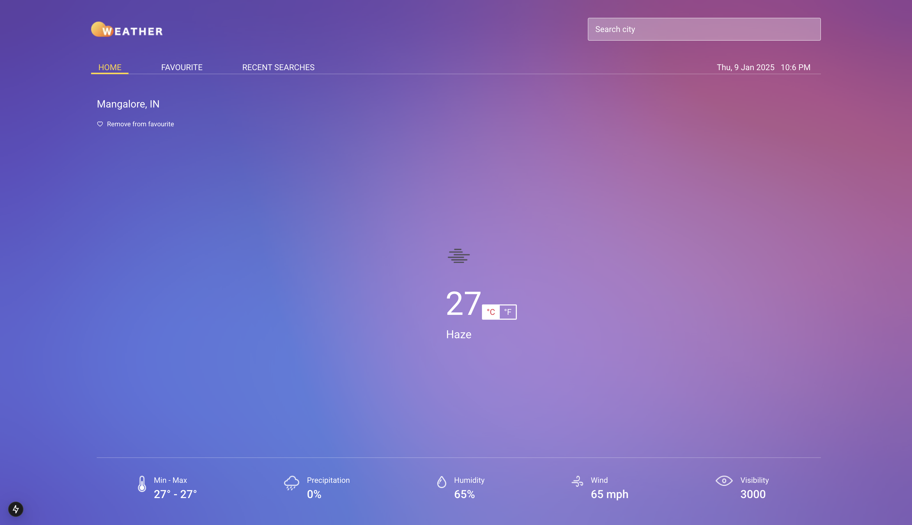
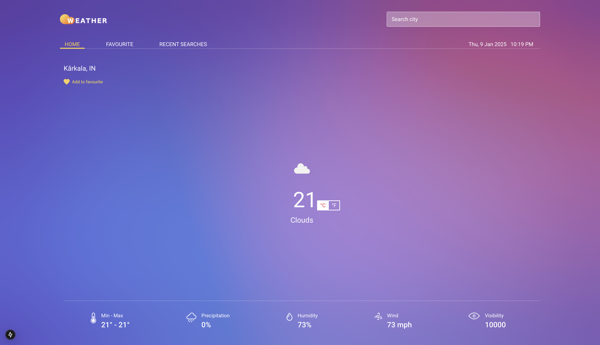
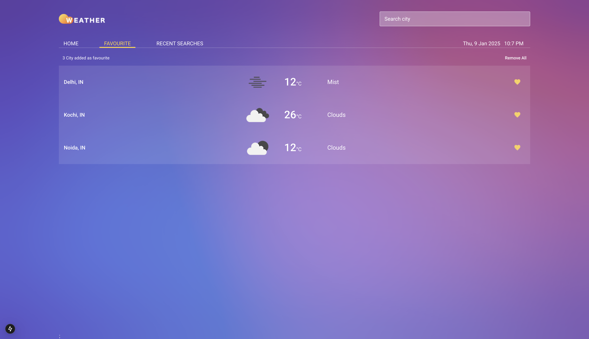
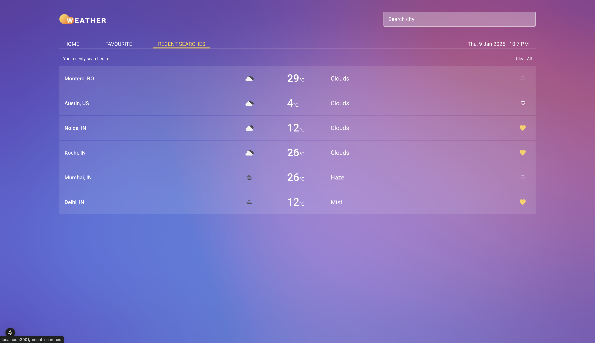
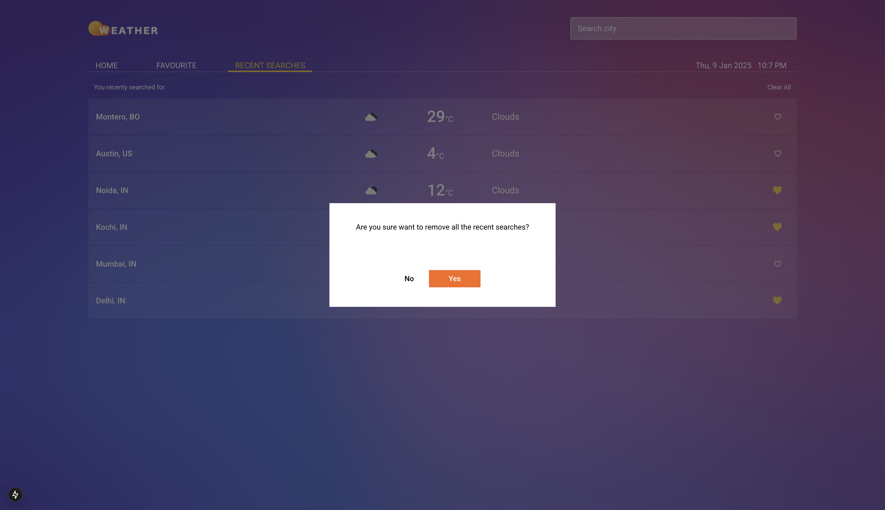

# Weather App NextJS

## About

- The App uses **OpenWeatherAPI** for the wether data of cities.
- Contains 3 Pages : Home, Favourites and Recent Searches.
- Intial Weather update is achieved based on the system location.
- The **Search Feature** allows searching for Weather of a city.
- Cities can be can be added to Favourites for future references.
- **Favourites Page** presents a list of liked Cities.
- **Recent Searches Page** present a list of searched cities.

## App UI

- Home Page
  
  
- Favourites Page
  
- Recent Searches Page
  
  

## Structure

## Tech

|  Functionality   |       Used        |
| :--------------: | :---------------: |
|    Framework     |      NextJS       |
|     Language     |    Javascript     |
|     Styling      |    CSS Module     |
|     Routing      | NextJS App Router |
| State Management |   Redux Toolkit   |

## App Creation.

npx create-next-app@latest

✔ What is your project named? … weather-app-nextjs
✔ Would you like to use TypeScript? … No
✔ Would you like to use ESLint? … Yes
✔ Would you like to use Tailwind CSS? … No
✔ Would you like your code inside a `src/` directory? … No
✔ Would you like to use App Router? (recommended) … Yes
✔ Would you like to use Turbopack for `next dev`? … No
✔ Would you like to customize the import alias (`@/*` by default)? … No

npm run dev

#### Notes

- Here app/ is used for routing components.
- components/ is used for normal components.
- Used module css for styling.
